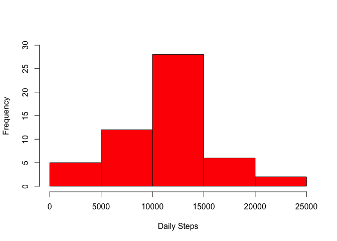
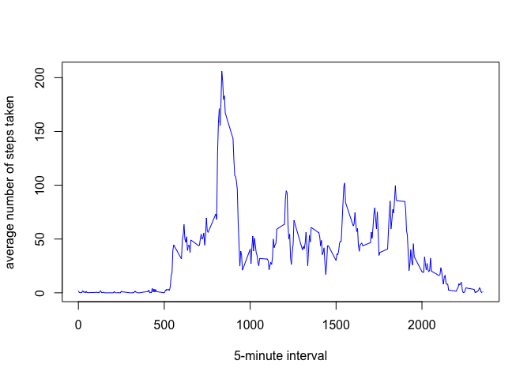
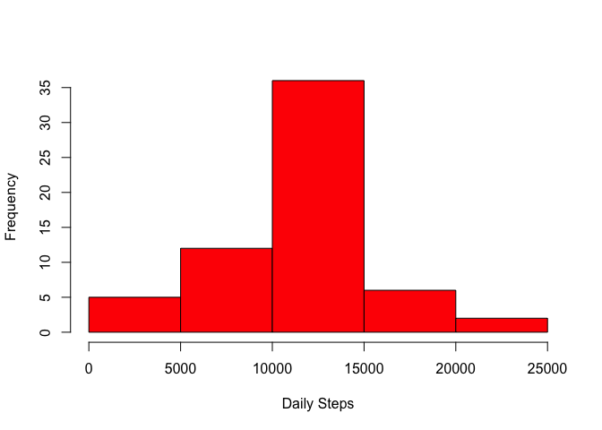
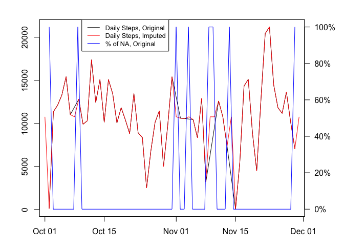
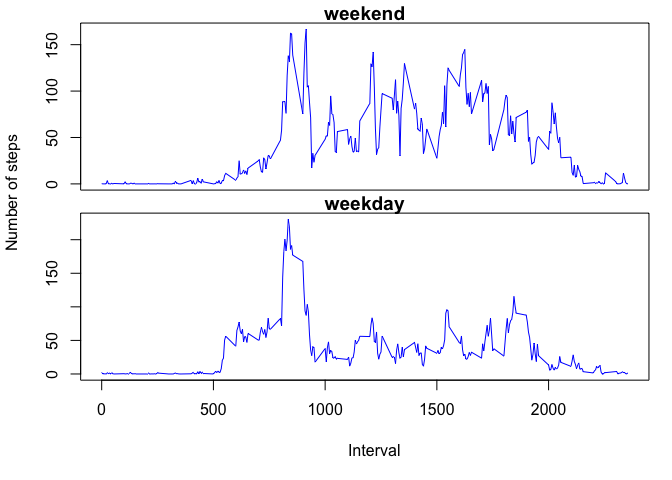

# Reproducible Research: Peer Assessment 1


## Loading and preprocessing the data

Reading CSV file:

```r
data <- read.csv("activity.csv")
```
Converting dates from characters into Date type:

```r
data$date <- as.Date(data$date,format="%Y-%m-%d")
```

## What is mean total number of steps taken per day?

First we calculate steps by day (while ignoring missing values):

```r
complete.data <- data[complete.cases(data),]
steps.daily <- aggregate(complete.data$steps, by=list(complete.data$date), FUN=sum)
```

Histogram of the total number of steps taken each day:

```r
hist(steps.daily[,2], main = "", xlab = "Daily Steps", col="red", ylim=c(0,30))
```

 

Mean total number of steps taken per day:

```r
mean(steps.daily[,2])
```

```
## [1] 10766.19
```

Median total number of steps taken per day:

```r
median(steps.daily[,2])
```

```
## [1] 10765
```

## What is the average daily activity pattern?

First we calculate steps by day (while ignoring missing values):

```r
steps.by.interval <- aggregate(complete.data$steps, by=list(complete.data$interval), FUN=mean)
```
Now making a time series plot averages accross all days:

```r
plot(steps.by.interval,type="l",xlab="5-minute interval",ylab="average number of steps taken", col="blue")
```

 

Calculating the 5-minute interval that on average, across all the days in the dataset, contains the maximum number of steps:

```r
steps.by.interval[which.max(steps.by.interval[,2]),1]
```

```
## [1] 835
```

## Imputing missing values

Total number of missing values in the dataset:


```r
sum(is.na(data$steps))
```

```
## [1] 2304
```

In order to fill in missing (NA) values, we'll use the earlier calculated average for each interval, taken across all the days. We'll put the imputed data into a new data frame "fdata":


```r
fdata <- data
for (i in 1:nrow(fdata)) {
    if(is.na(fdata[i,1])) {
        fdata[i,1] <- steps.by.interval[which(steps.by.interval[,1] == fdata[i,3]),2]
    }
}
```
Histogram of the total number of steps taken each day:

```r
steps.daily.imputed <- aggregate(fdata$steps, by=list(fdata$date), FUN=sum)
hist(steps.daily.imputed[,2], main = "", xlab = "Daily Steps", col="red")
```

 

Mean total number of steps taken per day:

```r
mean(steps.daily.imputed[,2])
```

```
## [1] 10766.19
```

Median total number of steps taken per day:

```r
median(steps.daily.imputed[,2])
```

```
## [1] 10766.19
```

The mean number of steps is the same as in the original data set. Median number is higher by 1 step, and equal to the mean. There is little to no difference of adding imputed values due to the fact, that when there are missing "steps" data in the original data set, then its missing for the whole day (i.e. 100% of steps for the day are NAs), and since we've substitued NA with daily average for each interval, the overal daily average remains the same. The median is higher, as we are adding values with average value, thus pushing the median closer to the average (in our second data set they are equal). 

The graph below illustrates the % of daily NAs (being either 0% or 100%) and daily steps in original and imputed data sets:


```r
par(mar=c(3,4,2,4))
plot(steps.daily[,1],steps.daily[,2], type="l",xlab="",ylab="")
points(steps.daily.imputed[,1],steps.daily.imputed[,2], type="l", col="red")
par(new=TRUE)
data.na.count <- aggregate(is.na(data$steps), by=list(fdata$date), FUN=sum)
data.na.count[,2] <- data.na.count[,2] / (24*12)
plot(data.na.count,type="l",col="blue", xaxt="n",yaxt="n", xlab="", ylab="")
axis(4, at=pretty(data.na.count[,2]), lab=paste0(pretty(data.na.count[,2])*100,"%"), las=TRUE)
legend("topleft",inset = c(0.16,0), legend = c("Daily Steps, Original","Daily Steps, Imputed","% of NA, Original") ,lty=1, col=c("black","red","blue"),cex=0.8)
```

 


## Are there differences in activity patterns between weekdays and weekends?

Lets create a new factor variable in the dataset with two levels - "weekday" and "weekend" indicating whether a given date is a weekday or weekend day:


```r
fdata$wd <- weekdays(fdata$date)
fdata$wd[grep("Monday|Tuesday|Wednesday|Thursday|Friday", fdata$wd)] <- "weekday"
fdata$wd[grep("Saturday|Sunday", fdata$wd)] <- "weekend"
fdata <- transform(fdata, wd=factor(wd))
```
Now lets calculate avearage number of steps per interval on weekdays and weekends:

```r
fdata.avg <- aggregate(steps ~ wd+interval, fdata, mean)
```
Now lets plot the comparison:

```r
library(lattice)
xyplot(steps ~ interval | wd, data = fdata.avg, layout=c(1,2), type="l", ylab="Number of steps", xlab="Interval")
```

 

As we can see from the graph above:  

* weekday activity has one prominent spike above 200 steps in the morning, whereas weekend activity has a number of spikes through the day around 140 steps mark
* outside of the spikes, weekend activity through the day is generally higher than weekday: it rarely drops below 40 steps, where as weekday sees many intervals at around 30 steps  

Such graph may indicate that weekdays have many hours without significant activity through the day (e.g. device wearer is sitting in the office or at school), whereas weekends are spent more actively moving around. 
